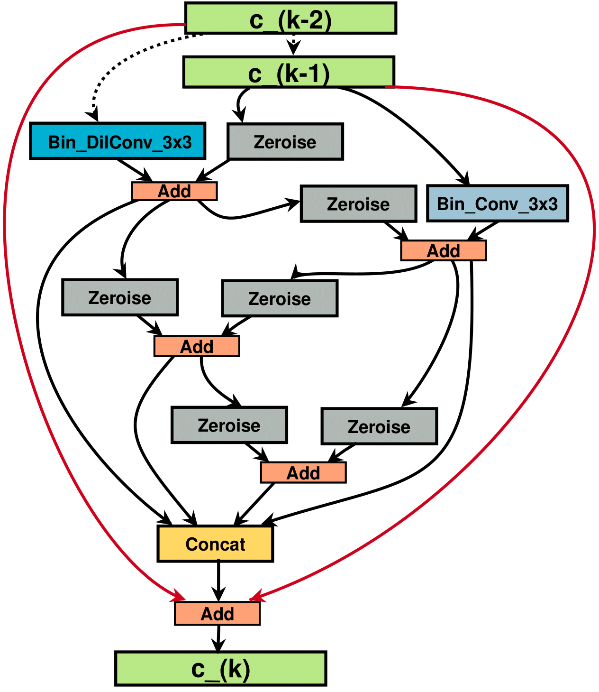
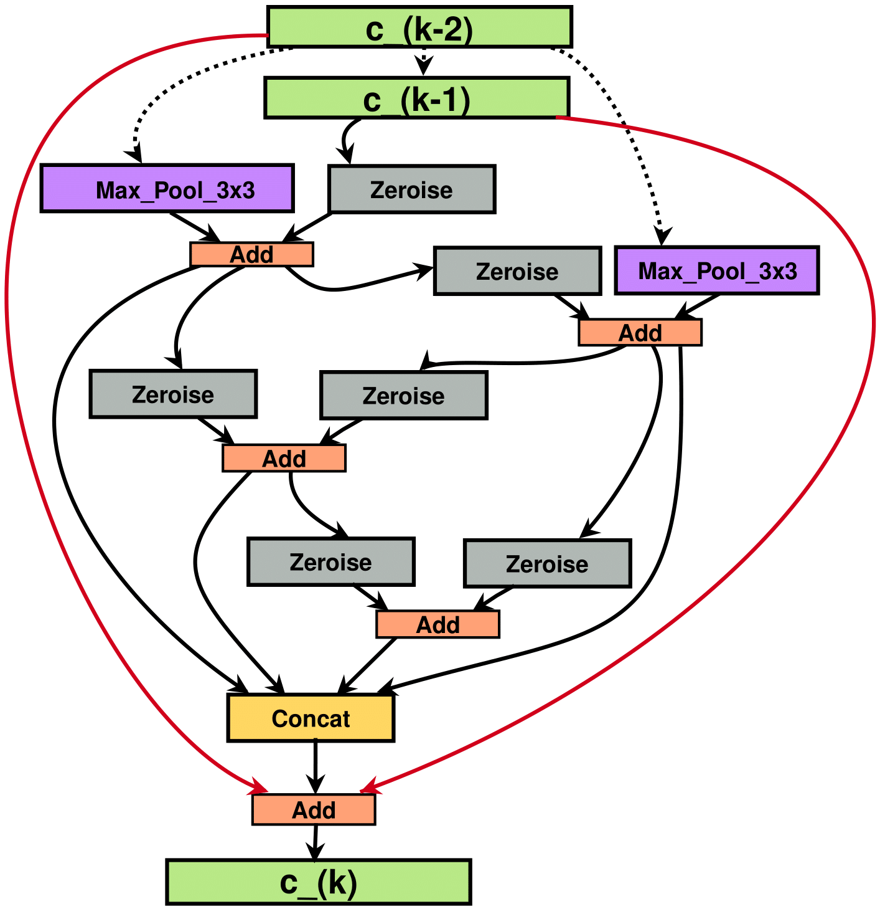

# Learning Architectures for Binary Networks

An Pytorch Implementation of the paper [Learning Architectures for Binary Networks](https://arxiv.org/abs/2002.06963) (*BNAS*) (ECCV 2020)<br>
If you find any part of our code useful for your research, consider citing our paper.

```bibtex
@inproceedings{kimSC2020BNAS,
  title={Learning Architectures for Binary Networks},
  author={Dahyun Kim and Kunal Pratap Singh and Jonghyun Choi},
  booktitle={ECCV},
  year={2020}
}
```

### Maintainer
* [Dahyun Kim](mailto:killawhale@gm.gist.ac.kr)
* [Kunal P. Singh](mailto:ksingh@ee.iitr.ac.in)


## Introduction

We present a method for searching architectures of a network with both binary weights and activations.
When using the same binarization scheme, our searched architectures outperform binary network whose architectures are well known floating point networks.

**Note**: our searched architectures still achieve competitive results when compared to the state of the art without additional pretraining, new binarization schemes, or novel training methods.

## Prerequisite - Docker Containers

We recommend using the below Docker container as it provides comprehensive running environment.
You will need to install `nvidia-docker` and its related packages following instructions [here](https://github.com/NVIDIA/nvidia-docker). 

Pull our image uploaded [here](https://hub.docker.com/r/killawhale/apex) using the following command.
```console
$ docker pull killawhale/apex:latest
```
You can then create the container to run our code via the following command.
```console
$ docker run --name [CONTAINER_NAME] --runtime=nvidia -it -v [HOST_FILE_DIR]:[CONTAINER_FILE_DIR] --shm-size 16g killawhale/apex:latest bash
``` 
- [CONTAINER_NAME]: the name of the created container
- [HOST_FILE_DIR]: the path of the directory on the host machine which you want to sync your container with
- [CONTAINER_FILE_DIR]: the name in which the synced directory will appear inside the container

**Note**: For those who do not want to use the docker container, we use PyTorch 1.2, torchvision 0.5, Python 3.6, CUDA 10.0, and Apex 0.1. You can also refer to the provided requirements.txt.

## Dataset Preparation

### CIFAR10
For CIFAR10, we're using CIFAR10 provided by torchvision.
Run the following command to download it.
```console
$ python src/download_cifar10.py
```
This will create a directory named `data` and download the dataset in it.

### ImageNet
For ImageNet, please follow the instructions below.

1. download the training set for the ImageNet dataset.
```console
$ wget http://www.image-net.org/challenges/LSVRC/2012/nnoupb/ILSVRC2012_img_train.tar
```
This may take a long time depending on your internet connection.

2. download the validation set for the ImageNet dataset.
```console
$ wget http://www.image-net.org/challenges/LSVRC/2012/nnoupb/ILSVRC2012_img_val.tar
```

3. make a directory which will contain the ImageNet dataset and move your downloaded .tar files inside the directory.

4. extract and organize the training set into different categories.
```console
$ mkdir train && mv ILSVRC2012_img_train.tar train/ && cd train
$ tar -xvf ILSVRC2012_img_train.tar && rm -f ILSVRC2012_img_train.tar
$ find . -name "*.tar" | while read NAME ; do mkdir -p "${NAME%.tar}"; tar -xvf "${NAME}" -C "${NAME%.tar}"; rm -f "${NAME}"; done
$ cd ..
```
5. do the same for the validation set as well.
```console
$ mkdir val && mv ILSVRC2012_img_val.tar val/ && cd val && tar -xvf ILSVRC2012_img_val.tar
$ wget -qO- https://raw.githubusercontent.com/soumith/imagenetloader.torch/master/valprep.sh | bash
$ rm -rf ILSVR2012_img_val.tar
```

6. change the synset ids to integer labels.
```console
$ python src/prepare_imgnet.py [PATH_TO_IMAGENET]
```
- [PATH_TO_IMAGENET]: the path to the directory which has the ImageNet dataset

You can optionally run the following if you only prepared the validation set.
```console
$ python src/prepare_imgnet.py [PATH_TO_IMAGENET] --val_only
```

## Inference with Pre-Trained Models

To reproduce the results reported in the paper, you can use the pretrained models provided [here](https://drive.google.com/drive/folders/14pmPSCb2u_4gHgeriRrBBkgIJ3J5p1O1?usp=sharing).

**Note**: For CIFAR10 we only share BNAS-A, as training other configurations for CIFAR10 does not take much time.
For ImageNet, we currently provide all the models (BNAS-D,E,F,G,H).

For running validation on CIFAR10 using our pretrained models, use the following command.
```console
$ CUDA_VISIBLE_DEVICES=0,1; python -W ignore src/test.py --path_to_weights [PATH_TO_WEIGHTS] --arch latest_cell_zeroise --parallel
```
- [PATH_TO_WEIGHTS]: the path to the downloaded pretrained weights (for CIFAR10, it's BNAS-A)

For running validation on ImageNet using our pretrained models, use the following command.
```console
$ CUDA_VISIBLE_DEIVCES=0,1; python -m torch.distributed.launch --nproc_per_node=2 src/test_imagenet.py --data [PATH_TO_IMAGENET] --path_to_weights [PATH_TO_WEIGHTS] --model_config [MODEL_CONFIG]
```
- [PATH_TO_IMAGENET]: the path to the directory which has the ImageNet dataset
- [PATH_TO_WEIGHTS]: the path to the downloaded pretrained weights
- [MODEL_CONFIG]: the model to run the validation with. Can be one of 'bnas-d', 'bnas-e', 'bnas-f', 'bnas-g', or 'bnas-h'

Expected result: 

|  Model | Reported Top-1(%) | Reported Top-5(%) | Reproduced Top-1(%) | Reproduced Top-1(%) |
|:------:|:-----------------:|:-----------------:|:-------------------:|:-------------------:|
| [BNAS-A](https://drive.google.com/file/d/1aSikzW8_sYJ5FuJsl54rnRg7kWsJKbf3/view?usp=sharing) |       92.70       |         -         |        ~92.39       |          -          |
| [BNAS-D](https://drive.google.com/file/d/165KA6Q2kn0Qrr8MKMruc10FtHM5JQgfP/view?usp=sharing) |       57.69       |       79.89       |        ~57.60       |        ~80.00       |
| [BNAS-E](https://drive.google.com/file/d/10rH9o8N9UdV-J8rCic2y6iXYn6z9WOKz/view?usp=sharing) |       58.76       |       80.61       |        ~58.15       |        ~80.16       |
| [BNAS-F](https://drive.google.com/file/d/1naNNrsBB78GvehmrsoRs4Qr3RlU40NCH/view?usp=sharing) |       58.99       |       80.85       |        ~58.89       |        ~80.87       |
| [BNAS-G](https://drive.google.com/file/d/1XOI6krbbBx_7u3A8Ikshvoh5LkihHNB2/view?usp=sharing) |       59.81       |       81.61       |        ~59.39       |        ~81.03       |
| [BNAS-H](https://drive.google.com/file/d/18wwejF135kX4dxfMtnFdEqHNEDRqNsIq/view?usp=sharing) |       63.51       |       83.91     |        ~63.70       |        ~84.49       |

*You can click on the links at the model name to download the corresponding model weights.*

**Note**: the provided pretrained weights were trained with [Apex](https://github.com/NVIDIA/apex) along with different batch size than the ones reported in the paper (due to computation resource constraints) and hence the inference result may vary slightly from the reported results in the paper.

More comparison with state of the art binary networks are in [the paper](https://arxiv.org/abs/2002.06963).

## Searching Architectures

To search architectures, use the following command.
```console
$ CUDA_VISIBLE_DEVICES=0; python -W ignore src/search.py --save [ARCH_NAME]
```
- [ARCH_NAME]: the name of the searched architecture

This will automatically append the searched architecture in the `genotypes.py` file.
Note that two genotypes will be appended, one for CIFAR10 and one for ImageNet.
The validation accuracy at the end of the search is not indicative of the final performance of the searched architecture. 
To obtain the final performance, one must train the final architecture from scratch as described next.


<p align="center">
  
  
</p>
<p align='center'>
  Figure:  One Example of Normal(left) and Reduction(right) cells searched by BNAS
</p> 
   
## Training Searched Architectures from scratch

To train our best searched cell on CIFAR10, use the following command. 
```console
$ CUDA_VISIBLE_DEVICES=0,1 python -W ignore src/train.py --learning_rate 0.05 --save [SAVE_NAME] --arch latest_cell_zeroise --parallel 
```
- [SAVE_NAME]: experiment name

You will be able to see the validation accuracy at every epoch as shown below and there is no need to run a separate inference code.
```console
2019-12-29 11:47:42,166 args = Namespace(arch='latest_cell_zeroise', batch_size=256, data='../data', drop_path_prob=0.2, epochs=600, init_channels=36, layers=20, learning_rate=0.05, model_path='saved_models', momentum=0.9, num_skip=1, parallel=True, report_freq=50, save='eval-latest_cell_zeroise_train_repro_0.05', seed=0, weight_decay=3e-06)
2019-12-29 11:47:46,893 param size = 5.578252MB
2019-12-29 11:47:48,654 epoch 0 lr 2.500000e-03
2019-12-29 11:47:55,462 train 000 2.623852e+00 9.375000 57.812500
2019-12-29 11:48:34,952 train 050 2.103856e+00 22.533701 74.180453
2019-12-29 11:49:14,118 train 100 1.943232e+00 27.440439 80.186417
2019-12-29 11:49:53,748 train 150 1.867823e+00 30.114342 82.512417
2019-12-29 11:50:29,680 train_acc 32.170000
2019-12-29 11:50:30,057 valid 000 1.792161e+00 30.859375 88.671875
2019-12-29 11:50:34,032 valid_acc 38.350000
2019-12-29 11:50:34,101 epoch 1 lr 2.675926e-03
2019-12-29 11:50:35,476 train 000 1.551331e+00 40.234375 92.187500
2019-12-29 11:51:15,773 train 050 1.572010e+00 42.256434 90.502451
2019-12-29 11:51:55,991 train 100 1.539024e+00 43.181467 90.976949
2019-12-29 11:52:36,345 train 150 1.515295e+00 44.264797 91.395902
2019-12-29 11:53:12,128 train_acc 45.016000
2019-12-29 11:53:12,487 valid 000 1.419507e+00 46.484375 93.359375
2019-12-29 11:53:16,366 valid_acc 48.640000
```
You should expect around 92% validation accuracy with our best searched cell once the training is finished at 600 epochs.
To train custom architectures, give custom architectures to the `--arch` flag after adding it in the `genotypes.py` file.
Note that you can also change the number of cells stacked and number of initial channels of the model by giving arguments to the `--layers` option and `--init_channels` option respectively.

With different architectures, the final network will have different computational costs and the default hyperparameters may not be optimal (such as the learning rate scheduling).
Thus, you should expect the final accuracy to vary by around 1~1.5% on the validation accuracy on CIFAR10.

To train our best searched cell on ImageNet, use the following command. 
```console
$ CUDA_VISIBLE_DEVICES=0,1,2,3 python -m torch.distributed.launch --nproc_per_node=4 src/train_imagenet.py --data [PATH_TO_IMAGENET] --arch latest_cell --model_config [MODEL_CONFIG] --save [SAVE_NAME]
```
- [PATH_TO_IMAGENET]: the path to the directory which has the ImageNet dataset
- [MODEL_CONFIG]: the model to train. Can be one of 'bnas-d', 'bnas-e', 'bnas-f', 'bnas-g', or 'bnas-h'
- [SAVE_NAME]: experiment name

You will be able to see the validation accuracy at every epoch as shown below and there is no need to run a separate inference code.
```console
2020-03-25 09:53:44,578 args = Namespace(arch='latest_cell', batch_size=256, class_size=1000, data='../../darts-norm/cnn/Imagenet/', distributed=True, drop_path_prob=0, epochs=250, gpu=0, grad_clip=5.0, init_channels=68, keep_batchnorm_fp32=None, label_smooth=0.1, layers=15, learning_rate=0.05, local_rank=0, loss_scale=None, momentum=0.9, num_skip=3, opt_level='O0', report_freq=100, resume=None, save='eval-bnas_f_retrain', seed=0, start_epoch=0, weight_decay=3e-05, world_size=4)
2020-03-25 09:53:50,926 no of parameters 39781442.000000
2020-03-25 09:53:56,444 epoch 0
2020-03-25 09:54:06,220 train 000 7.844889e+00 0.000000 0.097656
2020-03-25 10:00:01,717 train 100 7.059666e+00 0.315207 1.382658
2020-03-25 10:06:09,138 train 200 6.909059e+00 0.498484 2.070215
2020-03-25 10:12:21,804 train 300 6.750810e+00 0.838027 3.157119
2020-03-25 10:18:30,815 train 400 6.627304e+00 1.203534 4.369691
2020-03-25 10:24:37,901 train 500 6.526508e+00 1.601679 5.519625
2020-03-25 10:30:44,522 train 600 6.439230e+00 2.016983 6.666298
2020-03-25 10:36:50,776 train 700 6.360960e+00 2.424132 7.778648
2020-03-25 10:42:58,087 train 800 6.291507e+00 2.830446 8.824784
2020-03-25 10:49:04,204 train 900 6.228209e+00 3.251162 9.829681
2020-03-25 10:55:12,315 train 1000 6.167705e+00 3.673670 10.844819
2020-03-25 11:01:18,095 train 1100 6.112888e+00 4.080009 11.778710
2020-03-25 11:07:23,347 train 1200 6.060676e+00 4.500969 12.712388
2020-03-25 11:10:30,048 train_acc 4.697276
2020-03-25 11:10:33,504 valid 000 4.754593e+00 10.839844 27.832031
2020-03-25 11:11:03,920 valid_acc_top1 11.714000
2020-03-25 11:11:03,920 valid_acc_top5 28.784000
```
You should expect similar accuracy to our pretrained models once the training is finished at 250 epochs.

To train custom architectures, give custom architectures to the `--arch` flag after adding it in the `genotypes.py` file as.
Note that you can also change the number of cells stacked and number of initial channels of the model by giving arguments to the `--layers` option and `--init_channels` option respectively.

With different architectures, the final network will have different computational costs and the default hyperparameters may not be optimal (such as the learning rate scheduling).
Thus, you should expect the final accuracy to vary by around 0.2% on the validation accuracy on ImageNet.


**Note**: we ran our experiments with at least two NVIDIA V100s. For running on a single GPU, omit the `--parallel` flag and specify the GPU id using the `CUDA_VISIBLE_DEVICES` environment variable in the command line.   


